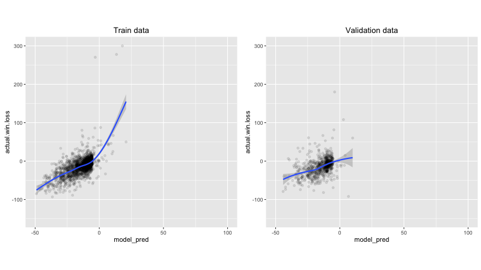
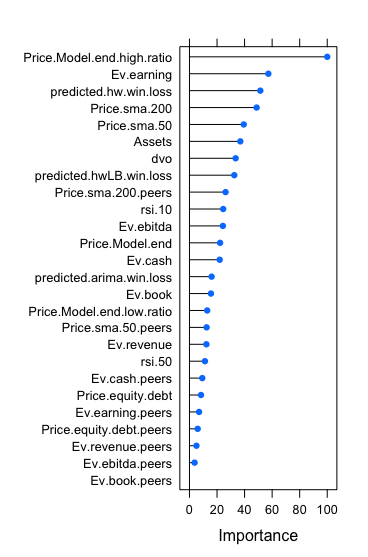
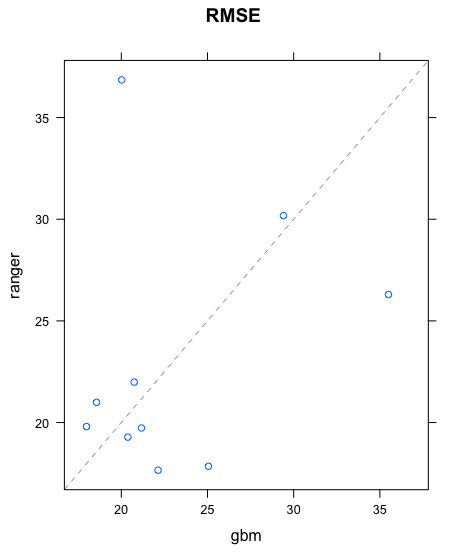
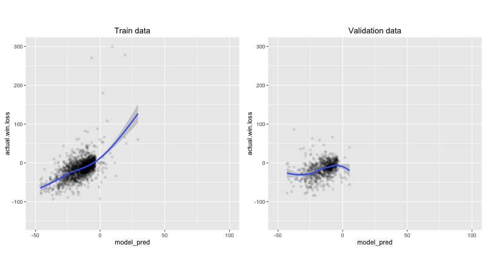
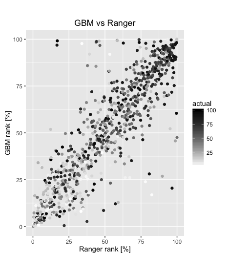
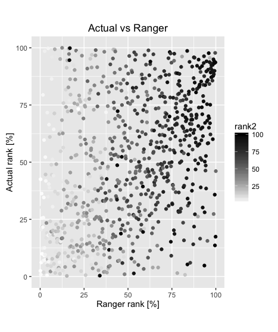
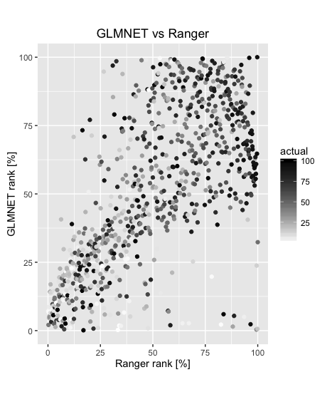

## Goal
The model attempts to predict the stock price of thousands of companies at a given date in the future (prediction date) based on current (or past) financial information and ranks the companies according to their stock performance. The model uses information freely available on the web (stock prices, reported quaterly financial data, etc.). The model uses financial data prior to a given date (end of model date). The figure of merit used to predict the performance of each stock is given by the equation  *(stock price at prediction date - stock price by end of model date)/(stock price by end of model date)*. 

## Data
The model is built using free financial information available from [yahoo](https://finance.yahoo.com/) and [google](https://www.google.com/finance?ei=5xv9V_DjGMnKmAG_kJBg) finance websites. Financial information is downloaded in a local directory using functions written in R (https://github.com/Fernando-Montes/Finance) (the code is based on   <https://github.com/mkfs> but had to be modified since the yahoo website has recently been changed). 
Since the model requires historical financial information from a given starting date (currently two years prior to end of model date), not all companies found on the [yahoo](https://finance.yahoo.com/) and/or [google](https://www.google.com/finance?ei=5xv9V_DjGMnKmAG_kJBg) websites satisfy this requirement. The information required by the model includes stock daily price and quaterly financial data for each company. The model takes into account the type of industry (services, financial, technology, etc.) and sector (electronics, multimedia, telecom domestic, etc.) each company belongs to.  The industry and sector information is obtained from the yahoo website. The model uses comparisons against peers within a given industry and sector. Stock prices and quaterly data are obtained using the quantmod and PerformanceAnalytics R packages.

There are companies that have been rejected in the model due to peculiarities in their
stock price. An example is a company like *brgo* that have what it seems wrong information since the price is unrealistically high for a couple of days and suddenly decreases to normal values. Another example is *mspc* that has information that is different in the google and yahoo websites. There are also a few companies (~20) that have a price less than 1 cent during the two years prior to the end model date (*brgo* and *mspc* among them). Those companies were not taken into account when constructing the model. Currently, only companies that have a stock price greater than $5 and belong to the Nasdaq or NYSE stock exchanges are included in the model.  There are currently about 2800-3000 companies that have all the information required by the model. 

## Code

The financial information is saved locally since it is time consuming to access both the yahoo and google websites every time the model is run and because google asks for user input (captcha screen) while downloading the information. All the files are written in R.

#### Files to download data:
- **SymbolBySector.R**: Helper functions to classify all stocks based on sector and industry based on information from yahoo finance. It contains function *list.sectors.industries* that returns a data frame with these information. It also saves the data frame *listAll* in *SectorIndustryInfo.RData* that contains sector and industry numbers and names.
- **Download.R**: Main file to download and save information to be used by the model. It uses helper functions to create data frame (*stockInfo*) containining stock symbol, sector and industry numbers (in *StockInfo.RData*). It also downloads daily and quaterly financial data for all the companies listed in *stockInfo*.

#### Files to run the model:
- **StockModel.R**: Main file that prepares the model and runs it.
- **StockInfo.R**: Helper functions to be used by PrepareTable.R
- **PrepareTable.R**: Creates data frame *table.model* that contains information for each stock (i.e. current stock price, earnings in the last quarter, equity/debt, moving stock price averages, etc.). Some of these variables will be used in the model.
- **PrepareTableSector.R**: Adds peer-based-comparison variables to data frame *table.model* (i.e. enterprise value/earnings of the stock / average ratio of its peers).
- **StockInfoHistorical.R**: Adds historical quaterly comparison variables to data frame *table.model* (i.e. enterprise value/earnings of the stock / ratio from same quarter the previous year).
- **PrepareStockModel.R**: Function to select which ML method and which variables will be used by the model. 

## Model

The model was constructed using the following variables (keep in mind the model is not final and I update it about every 6 months or so). Reference to the stock price in the following variables correspond to the stock price at the time the model is constructed (end of model date). Variables that use financial data such as total assets, enterprise value, book value, etc. are from the most recent quarter prior to end of model date. 

Variable                    |Meaning
----------------------------|-------------------------------------------------------------------------------------------------------------
Ev.earning                  |Enterprise value / earnings 
Ev.ebitda                   |Enterprise value / EBITDA (earnings before interests, taxes, depreciation, amortization and unusual expenses) 
Ev.book                     |Enterprise value / book value
Ev.revenue                  |Enterprise value / revenue
Ev.cash                     |Enterprise value / cash
Price.equity.debt           |Stock price /(Total equity/ Total debt)

Variables that use comparisons with their peers:

Variable                    |Meaning
----------------------------|-------------------------------------------------------------------------------------------------------------
Ev.earning.peers            |Enterprise value / earnings divided by the average of the same ratio obtained from companies within the same sector-industry
Ev.ebitda.peers             |Enterprise value / EBITDA divided by the average of the same ratio obtained from companies within the same sector-industry
Ev.book.peers               |Enterprise value / book value divided by the average of the same ratio obtained from companies within the same sector-industry
Ev.revenue.peers            |Enterprise value / revenue divided by the average of the same ratio obtained from companies within the same sector-industry
Ev.cash.peers               |Enterprise value / cash divided by the average of the same ratio obtained from companies within the same sector-industry
Price.equity.debt.peers     |Stock price /(Total equity/ Total debt) divided by the average of the same ratio obtained from companies within the same sector-industry
Price.sma.200.peers         |Stock price / Simple moving 200-day-average of the stock price divided by the average of the other companies within the same sector-industry
Price.sma.50.peers          |Stock price / Simple moving 50-day-average of the stock price divided by the average of the other companies within the same sector-industry

Variables that use historical information:

Variable                          |Meaning
----------------------------------|--------------------------------------------------------------------------------------------------------
Price.Model.end.low.ratio   |Stock price / lowest stock price during the last 2 years
Price.Model.end.high.ratio  |Stock price / highest stock price during the last 2 years
predicted.hw.win.loss       |Predicted future performance using a Holt-Winters model of the stock price
predicted.hwLB.win.loss     |Predicted future lower bound performance with 90% confidence using a Holt-Winters model of the stock price
predicted.arima.win.loss    |Predicted future performance using ARIMA forecast
Price.sma.200               |Stock price / Simple moving 200-day-average of the stock price
Price.sma.50                |Stock price / Simple moving 50-day-average of the stock price
rsi.10                      |Relative Strength Index RSI over 10 days: it expresses the fraction of gains and losses over the past lookback periods, 100 - (100/(1 + RS)), where RS is the average gain over the average loss over the lookback window decided.
rsi.50                      |Relative Strength Index RSI over 50 days
dvo                         |Value representing the percentage rank of the stock price between the lowest and highest stock price during the last 2 years
earning.histo               |Enterprise value / earnings divided by the same ratio the same quarter the previous year
ebitda.histo                |Enterprise value / EBITDA divided by the same ratio the same quarter the previous year
book.histo                  |Enterprise value / book value divided by the same ratio the same quarter the previous year
revenue.histo               |Enterprise value / revenue divided by the same ratio the same quarter the previous year
cash.histo                  |Enterprise value / cash divided by the same ratio the same quarter the previous year
equity.debt.histo           |Stock price /(Total equity/ Total debt) divided by the same ratio the same quarter the previous year

A variable specifying the sector the stock belong to was removed from the model since that variable ended up being one of the most important variables while training the model. Unfortunately since it is likely that the same performance will not be repeated in the future, it is not very helpful in predicting the future (as verified while checking the model performance). Other variables included in earlier iterations of the model were specific stock price categories and/or assets but are currently removed since the same information is already included in the current variables. 

The model uses a random forest, generalized linear model and/or a boosted regression methods. The implementation is done using the caret R package ($ranger$, $glmnet$, $gbm$, methods respectively). Some hyper-parameter optimization has been done but further optimization and method exploration is one of the main areas where the model could still be improved.

## Comments on results

#### Importance of sector and industry information:

In an earlier iteration of the model, no peer comparison variables were used but instead a variable specifying the sector-industry of each company was used. Not all historical variables were used. The time horizon used in the following was 15 months in the future (from the data financial information is last available). The model was prepared with data from 2013/06/03 to 2015/06/30 for a prediction at 2016/09/30. The most important variables using the $gbm$ method were:

<!-- Table generated in R 3.3.2 by googleVis 0.6.2 package -->
<!-- Wed Jan 17 08:36:20 2018 -->

<!-- jsHeader -->

 
<!-- jsChart -->  

 
<!-- divChart -->
  

All other variables are not relevant (rel.inf = 0). A variable specifying if __SectorIndustry.Num__ were 134 and 133 (Gold and Industrial Metals & Minerals, respectively) was the most important. The prediction performance compared to the actual performance in the train data looks reasonable. Not only for the highest performers but also for the laggarts. The same comparison in the validation data also seems decent,

but there is a problem. These are the best 10 results in the validation data:

<!-- Table generated in R 3.3.2 by googleVis 0.6.2 package -->
<!-- Wed Jan 17 08:36:20 2018 -->

<!-- jsHeader -->

 
<!-- jsChart -->  

 
<!-- divChart -->
  

All of the top results were from __SectorIndustry.Num__ 134 (Gold).  If industries 134 and 133 are removed from the final results (but still keeping them in the model), the model results are much worse and there does not seem to be a correlation between prediction and actual performance in the validation data:

In order to reduce the influence of the variable specifying the sector and industry of the company (it is likely that that performance will not be repeated in the future), the variables specifying the valuations of a given stock compared to other companies with the same sector-industry-number (peer-comparison variables) were added.

The variables importance in the $gbm$ model are in the following table:

<!-- Table generated in R 3.3.2 by googleVis 0.6.2 package -->
<!-- Wed Jan 17 08:36:20 2018 -->

<!-- jsHeader -->

 
<!-- jsChart -->  

 
<!-- divChart -->
  

Calculating the RMSE directly in the train and validation data sets result in 56.1 and 59.4 respectively. 

The random forest model $ranger$ results in 26.9 (the model still needs to be improved as it is severly overfitting) and 57.6 for the RMSE in train and validation data respectively:

The linear regression model $glmnet$ performs badly and results in an RMSE in the validation data larger than a 100.

#### Variables containing historical information:

Adding variables containing historical information does not result in a large improvement in any of the models. Moreover, the calculated RMEs are highly variable depending on the splitting between training and testing data indicating there is over-fitting. The relative importance of the variables for the $ranger$ method is shown in this Figure:

     

The train data is over-fitted with the $ranger$ method but the validation data modeling is not worse than using the $gbm$ (or any other method) method. 

#### Time horizon:

Using a shorter time horizon of 3 months instead of the 15 months used in the previous sections, results in much improved predictions for the model. The RMSE of both the training and validation data get better (in the 20-30 range) for all methods. For the $gbm$ method, this is what the predictions look like:

The relative importance of the different variables also change. Variables containing Enterprise Value become more relevant. Peer comparison variables does not seem to matter much compared to valuation and historical variables.

 

#### Variables containing quaterly information (assets, equity, etc.):

If all the variables containing quaterly data information (earnings, revenue, book value, etc.) are eliminated, the results do not change much.

For the $gbm$ method, this is what the predictions look like:

#### Robustness of the results using different ML methods:

In the following valuation, peer-comparison and historical variables are included except quaterly valuation variables or the same quarter previous year historical variables. 

This is how the ranking of predictions compare between $gbm$ and $ranger$ methods:

Notice how there are some companies that have a high rank in one of the methods but not in both. There are also some companies highly ranked in both methods. The colors indicate the ranking based on the ranking of actual performances. Notice that there are more high ranking (high gains) companies in the top right corner than in the bottom left corner. However, the correlation between model ranking and actual win/loss ranking is not great (rank2 refers to the ranking obtained using the $gbm$ method): 

The last figure should show a linear correlation if the model were perfect. As it, there is still a lot of room for improvement. 

The correlation between results using $glmnet$ and $ranger$ is not as clean as in the previous figures. Companies with high rankings in both methods also seem to have good rankings in the actual win/loss ranking.

As expected, the previous results are robust when using different train data sets.

The following companies are obtained when requiring a rank above 90% for all methods ($ranger$, $gbm$ and $glmnet$) using data from 2013/06/03 to 2015/06/30 (end of model date) for a 2015/09/30 stock price prediction: 

<!-- Table generated in R 3.3.2 by googleVis 0.6.2 package -->
<!-- Wed Jan 17 08:36:20 2018 -->

<!-- jsHeader -->

 
<!-- jsChart -->  

 
<!-- divChart -->
  

Using the trained $ranger$ and $gbm$ methods for data from 2013/09/03 to 2015/09/30 for a 2015/12/31 prediction results in a RMS of 34 for both methods. Method $glmnet$ has an outlier that makes the RMS blow up. These are the companies with the highest actual ranking and their method rankings:

<!-- Table generated in R 3.3.2 by googleVis 0.6.2 package -->
<!-- Wed Jan 17 08:36:20 2018 -->

<!-- jsHeader -->

 
<!-- jsChart -->  

 
<!-- divChart -->
  

None of the methods is particularly good. It seems that the assumption that a model created and optimized at an earlier time (3 months in this case) is not completely valid or useful by the time it has to be used. 
Requiring an average rank between the different methods ($ranger$, $gbm$ and $glmnet$) above 95.5%, results in the following companies:

<!-- Table generated in R 3.3.2 by googleVis 0.6.2 package -->
<!-- Wed Jan 17 08:36:20 2018 -->

<!-- jsHeader -->

 
<!-- jsChart -->  

 
<!-- divChart -->
  

which have an average actual win loss performance percentage of 4.6%. The average performance percentage of all the companies considered during the same time period is 0.7%. 

Adding quarterly variables (but not same quarter previous year) results in an even better model performance since the average performance percentage increases to 7.5% for the best companies in all models (compared to 0.7% for all companies).

Changing the construction of the model from 2014/03/03 to 2016/03/31 and applying it to 2016/06/30, obtains an average performance percentage of 22.4% for companies with a predicted average ranking of 97%, compared to 5.4% for the average for all companies. However, when using the same model for data from 2014/06/03 to 2016/06/30 for a prediction by 2016/09/30 obtains an average actual win loss percentage of -3.4% for companies with a predicted average ranking of 99%, compared to 8.7% for the average for all companies. 

## Conclusion
This is a still a work in progress. Several improvements still need to be done before I can really trust the model:

- Test the effect of historical variables that use historial quaterly information for different time frames.  
- Improve hyper-parameter selection in current models.
- Extend to other models and methodologies.
- Add a google trend variables (stock and sector).

