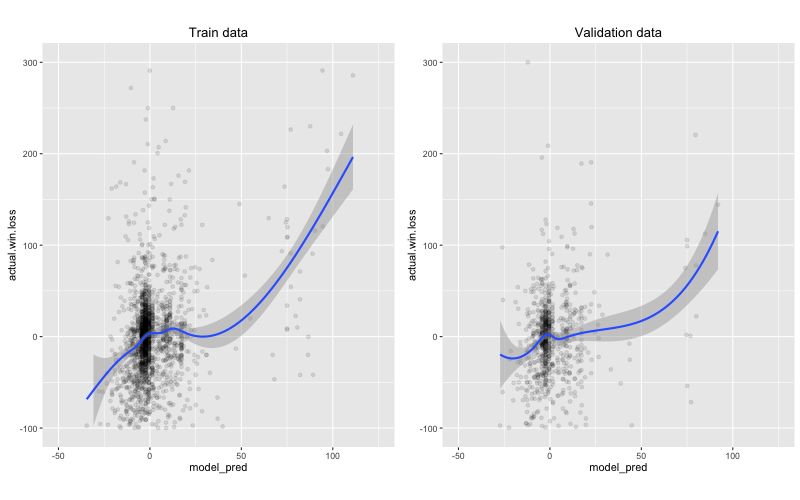
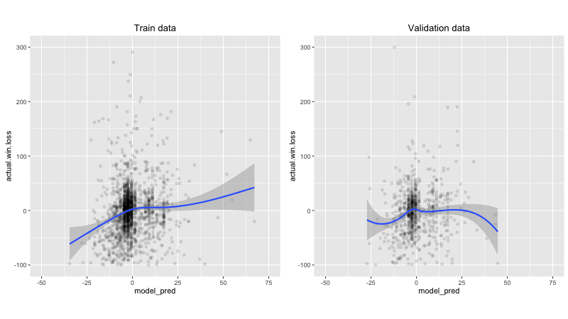
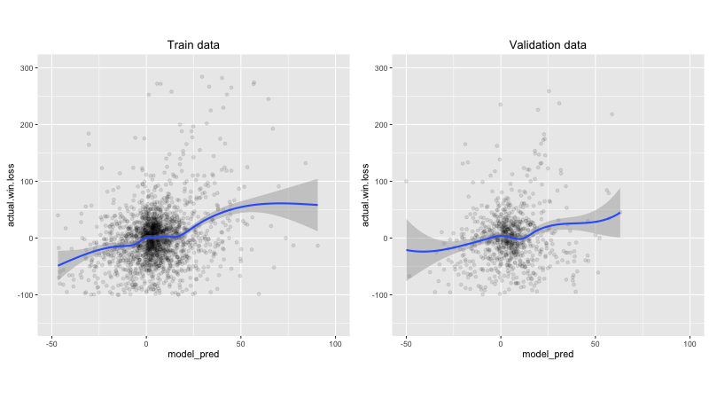
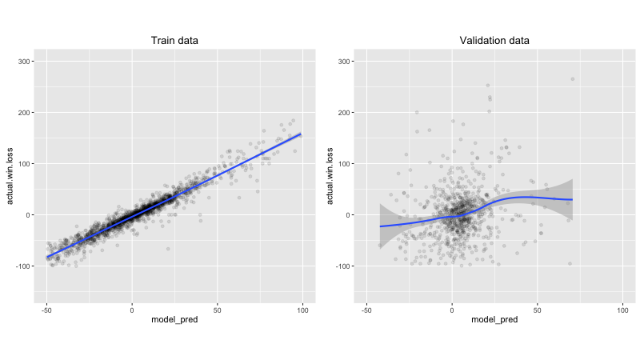
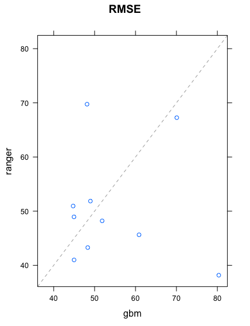
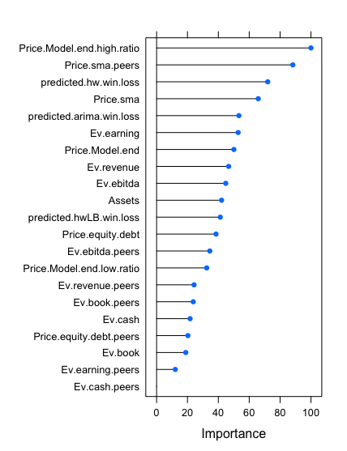

```{r setup, include=FALSE}
knitr::opts_chunk$set(echo = TRUE)
```

# Goal
The goal is to predict the performance of a given stock from financial information available in the past. The model attempts to predict the performance using a time horizon of 15 months. The model has been run the first week of October 2016. The figure of merit used to predict the performance is *actual.win.loss =  (current stock price - stock price 15 months ago)/(stock price 15 months ago)*.

# Data
The model is built using with the financial information available until June 30, 2015 (this date is referred to as end.model.date). It uses 2 years of historical stock price per month. The price at end.model.date divided by the lowest and highest stock prices during those two years are variables of the model. Information is downloaded from [yahoo](https://finance.yahoo.com/) and [google](https://www.google.com/finance?ei=5xv9V_DjGMnKmAG_kJBg) finance. It uses packages quantmod and PerformanceAnalytics.

```{}
# Obtaining historical stock price data
    SYMB_prices <- get.hist.quote(instrument=stock, quote="AdjClose",provider="yahoo", compression="m", retclass="zoo", quiet=TRUE)
```

```{}
# Obtaining stock financial info
    FinStock <- getFinancials(stock, auto.assign = FALSE)
```

All the stocks available in yahoo finance are tentatively used in the model preparation and prediction. The implementation of which information is available online is based on <https://github.com/mkfs> and from functions written by [me](https://github.com/Fernando-Montes/Finance). 

There are 2755 companies that have all the information required in the model. 

Companies like *brgo* have what it seems wrong information. The price was that high only for a couple of days. Another example is *mspc* that has information that is different from what the yahoo website has. It there something wrong with some of these ultra cheap stocks?
There are 18 companies that have a price less than 1 cent during the two years prior to the end model date (*brgo* and *mspc* among them). Those companies were not taken into account when constructing the model. 

# Code
The financial information is saved locally since it is time consuming to access websites every time the model is run, and because google asks for user input (captcha screen) if running the script. The main file is StockModel.R. The file names describes what each file does. 

```{r echo=FALSE, message=FALSE, warning=FALSE}
suppressPackageStartupMessages(library(diagram))
# http://artax.karlin.mff.cuni.cz/r-help/library/diagram/html/plotmat.html
names <- c("Download.R", "SymbolBySector.R", "Saved data", "StockInfo.R", "PrepareStockModel.R", "StockModel.R",  "PrepareTableSector.R", "PrepareTable.R")
M <- matrix(nrow = 8, ncol = 8, byrow = TRUE, data = 0)
curves <- matrix(nrow = 8, ncol = 8, data = 0)
M[1,2] <- "listAll"
M[3,1] <- "save_data"
#curves[3, 1] <- 0.2
M[6,3] <- "StockInfo" 
#curves[4, 3] <- 0.8
M[6,5] <- "prepare.model()"
#curves[6, 5] <- 0.05
M[8,6] <- "prepare.table()"
#curves[8, 6] <- -0.05
M[8,4] <- "add.stock.to.table()"
curves[8, 4] <- -0.78
M[4,6] <- "StockInfo" 
#curves[4,6] <- 0.25
M[4,3] <- "Read_data" 
M[7,6] <- "prepare.table.sector()"
plotmat(M, pos = c(2, 2, 2, 2), name = names, lwd = 2, box.lwd = 1, cex.txt = 0.7, curve = curves,
        box.size = 0.16, box.type = "circle", box.prop = 0.2, relsize = 0.78, box.cex = 0.7, my = 0.17,
         main = "Stock model files")
```

# Model and Results

## Attempts 1-10: 
The preferred model was a $gbm$ model with the following variables:

Variable                    |Meaning
----------------------------|-------------------------------------------------------------------------------------------------------------
Price.Model.end.low.ratio   |Stock price / lowest stock price during the last 2 years
Price.Model.end.high.ratio  |Stock price / highest stock price during the last 2 years
Price.Model.end             |Stock price
Assets                      |Total assets
Ev.earning                  |Enterprise value / earnings 
Ev.ebitda                   |Enterprise value / EBITDA (earnings before interests, taxes, depreciation, amortization and unusual expenses) 
Ev.book                     |Enterprise value / book value
Ev.revenue                  |Enterprise value / revenue
Ev.cash                     |Enterprise value / cash
Price.equity.debt           |Stock price /(Total equity/ Total debt)
predicted.win.loss          |Predicted performance using a Holt-Winters model of the stock price
predictedLB.win.loss        |Predicted lower bound performance using a Holt-Winters model of the stock price
SectorIndustry.Num          |Sector-industry number the stock belongs to

The actual model construction[^1]:
```{}
   my_model <- train(
    actual.win.loss ~ Price.Model.end.low.ratio + Price.Model.end.high.ratio + Price.Model.end + Assets +
      Ev.earning + Ev.ebitda + Ev.book + Ev.revenue + Ev.cash + Price.equity.debt +
      predicted.win.loss + predictedLB.win.loss + SectorIndustry.Num, 
    method ="gbm", data = my_train, train.fraction = 0.5, tuneLength = 10,  #mtry can change from 1 to tuneLength
    trControl = trainControl(method = "cv", number = 5, repeats = 10, verboseIter = TRUE)
    )
```
[^1]: The $gbm$ method does not work correctly if train.fraction is not defined explicitely. 

I played with varying the variables and I noticed that some variables are used incorrectly by *caret* and/or *gbm*. Using a factor that has 4 levels according to the stock price at the end model date (<1, 1-10, 10-100, >100) did not work. The final model was incorrectly only assigning 3 *categories* (same as levels?) and I could not make it work. Furthermore, those categories were not relevant in the final model. Therefore, I decided to use __Price.Model.end__ instead. 

The following results are obtained:
```{}
my_model$results
    shrinkage interaction.depth n.minobsinnode n.trees     RMSE   Rsquared    RMSESD  RsquaredSD
1         0.1                 1             10      50 58.57166 0.04230435 10.026998 0.042328721
```

Calculating the RMSE directly in the train and validation data sets result in 57.4 and 54.5 respectively. The same for method $ranger$ results in 30.4 and 54.3.  The RMSE results for method $glmnet$ are 57.3 and 50. The problem with $glmnet$ is that variable __SectorIndustry.Num__ is the most relevant variable by a large margin. All other variables seem to be irrelevant. Is this a problem with the method or with the way the model is built? By selecting the $gbm$ method, more variables matter. The important variables in $gbm$ are in the following table.

```{r echo=FALSE, message=FALSE, warning=FALSE}
suppressPackageStartupMessages(library(googleVis))
```
```{r results='asis', echo=FALSE}
load(file = "~/Dropbox/Courses/R/Finance/Figures/imp_par.Rda")
tab1 <- gvisTable(head(imp_par, 13))
print(tab1, "chart")
```

All other variables are not relevant (rel.inf = 0). __SectorIndustry.Num__ 134 and 133 are Gold and Industrial Metals & Minerals, respectively.
The train data prediction compated to the actual return (in percentage) looks reasonable. Not only for the highest performers but also for the laggarts. The validation data also seems decent



but there is a problem. These are the best 10 results in the validation data:
```{r echo=FALSE, message=FALSE, warning=FALSE}
suppressPackageStartupMessages(library(googleVis))
```
```{r results='asis', echo=FALSE}
load(file = "~/Dropbox/Courses/R/Finance/Figures/Res_val.Rda")
tab1 <- gvisTable(head(res_val, 10))
print(tab1, "chart")
```

All of the top results are from __SectorIndustry.Num__ 134 (Gold).  If industries 134 and 133 are removed from the final results (but still keeping them in the model), the model results are much worse:



## Attempts 10-12: 
Assuming the problem with the previous attempts were the chosen variables, variables were changed. Valuations valuations of a given stock 
compared to other companies with the same Sector-industry-number were added:

Variable                    |Meaning
----------------------------|-------------------------------------------------------------------------------------------------------------
Ev.earning.peers            |Enterprise value / earnings of the stock divided by its average value (stocks in the same sector-industry)
Ev.ebitda.peers             |Enterprise value / EBITDA of the stock divided by its average value (stocks in the same sector-industry)
Ev.book.peers               |Enterprise value / book value of the stock divided by its average value (stocks in the same sector-industry)
Ev.revenue.peers            |Enterprise value / revenueof the stock divided by its average value (stocks in the same sector-industry)
Ev.cash.peers               |Enterprise value / cash of the stock divided by its average value (stocks in the same sector-industry)
Price.equity.debt.peers     |Stock price /(Total equity/ Total debt) of the stock divided by its average value (stocks in the same sector-industry)

The variable __SectorIndustry.Num__ was removed since the sector performance over model training period is taken into account and it is likely that that performance will not be repeated in the future.

The variables importance in a $gbm$ model are in the following table:
```{r echo=FALSE, message=FALSE, warning=FALSE}
suppressPackageStartupMessages(library(googleVis))
```
```{r results='asis', echo=FALSE}
load(file = "~/Dropbox/Courses/R/Finance/Figures/imp_par2.Rda")
tab1 <- gvisTable(head(imp_par, 13))
print(tab1, "chart")
```

Calculating the RMSE directly in the train and validation data sets result in 56.1 and 59.4 respectively. Those numbers are slightly worse than during attempts 1-10 but the results and the relative importance of the variables look better.



The random forest model $ranger$ results in 26.9 and 57.6 for the RMSE in train and validation data respectively:



The linear regression model $glmnet$ performs badly and results in an RMSE in the validation data larger than a 100.

## Attempts 12-: 

Changes from previous attempts:

* Variables added:
      + Simple moving average variable (over 200 days) and comparison with its peers.
      + ARIMA forecast prediction.
* Changed varibles calculating the stock price over the lowest (and highest) stock price during the last 2 years to a calculation that uses daily stock prices instead of monthly stock prices.
* Corrections:
      + Holt-Winters prediction and its lower bound with 90% confidence were calculated with a time horizon incorrectly calculated (it was 1 month too long).
      + Stock price at end.model.date was incorrectly taken one month later. This affected all variables involving this price. 
      
In the previous attempts and these ones too, the calculated RMEs are highly variable depending on the splitting between training and testing data. This observation is independent of the method used:



The relative importance of the variables also changes but not as much. This is a particular example for the $ranger$ method:

     

# To do
* Add/replace variables:
      + Add a google trend variables (stock and sector).
* Investigate changing time horizon.
