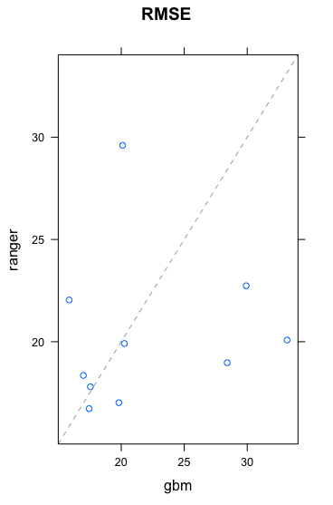
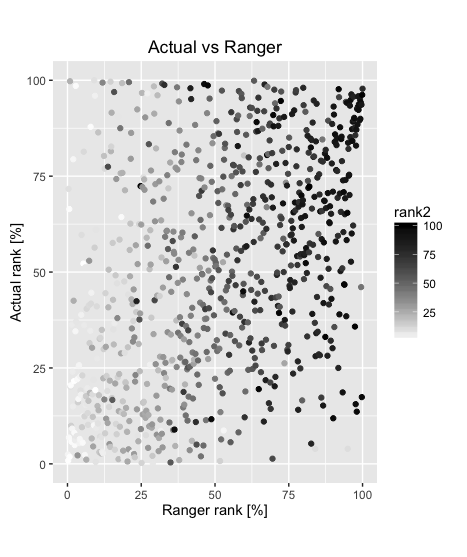

```{r setup, include=FALSE}
knitr::opts_chunk$set(echo = TRUE)
```

# Goal
The goal is to predict the performance of a given stock from financial information available in the past. The model attempts to predict the performance using a fixed time horizon. The figure of merit used to predict the performance is *actual.win.loss =  (stock price at prediction date - stock price by end of model date)/(stock price by end of model date)*.

# Data
The model is built using with financial information available on the web. The final date used in the model is referred to as end.model.date (it corresponds to stock price by end of model date). It uses 2 years of historical stock price to construct the model. The price at end.model.date divided by the lowest and highest stock prices during those two years are variables of the model. Information is downloaded from [yahoo](https://finance.yahoo.com/) and [google](https://www.google.com/finance?ei=5xv9V_DjGMnKmAG_kJBg) finance. It uses packages quantmod and PerformanceAnalytics.

```{}
# Obtaining historical stock price data
    SYMB_prices <- get.hist.quote(instrument=stock, quote="AdjClose",provider="yahoo", compression="m", retclass="zoo", quiet=TRUE)
```

```{}
# Obtaining stock financial info
    FinStock <- getFinancials(stock, auto.assign = FALSE)
```

Almost all stocks available in yahoo finance are used in the model preparation and prediction. Downloading of available information is is based on <https://github.com/mkfs> and from functions written by [me](https://github.com/Fernando-Montes/Finance). 

There are about 2750 companies that have all the information required in the model. 

Companies like *brgo* have what it seems wrong information since the price is unrealistically high for a couple of days and suddenly decreases to normal values. Another example is *mspc* that has information that is different from what the yahoo website has. It there something wrong with some of these ultra cheap stocks?
There are 18 companies that have a price less than 1 cent during the two years prior to the end model date (*brgo* and *mspc* among them). Those companies were not taken into account when constructing the model. **Update August 2017:** Only companies that have a stock price greater than $5 and belong to the Nasdaq or NYSE stock exchanges are included. 

# Code
The financial information is saved locally since it is time consuming to access websites every time the model is run, and because google asks for user input (captcha screen) if running the script. The main file is StockModel.R. The file names describes what each file does. 

```{r echo=FALSE, message=FALSE, warning=FALSE}
suppressPackageStartupMessages(library(diagram))
# http://artax.karlin.mff.cuni.cz/r-help/library/diagram/html/plotmat.html
names <- c("Download.R", "SymbolBySector.R", "Saved data", "StockInfo.R", "PrepareStockModel.R", "StockModel.R",  "PrepareTableSector.R", "PrepareTable.R")
M <- matrix(nrow = 8, ncol = 8, byrow = TRUE, data = 0)
curves <- matrix(nrow = 8, ncol = 8, data = 0)
M[1,2] <- "listAll"
M[3,1] <- "save_data"
#curves[3, 1] <- 0.2
M[6,3] <- "StockInfo" 
#curves[4, 3] <- 0.8
M[6,5] <- "prepare.model()"
#curves[6, 5] <- 0.05
M[8,6] <- "prepare.table()"
#curves[8, 6] <- -0.05
M[8,4] <- "add.stock.to.table()"
curves[8, 4] <- -0.78
M[4,6] <- "StockInfo" 
#curves[4,6] <- 0.25
M[4,3] <- "Read_data" 
M[7,6] <- "prepare.table.sector()"
plotmat(M, pos = c(2, 2, 2, 2), name = names, lwd = 2, box.lwd = 1, cex.txt = 0.7, curve = curves,
        box.size = 0.16, box.type = "circle", box.prop = 0.2, relsize = 0.78, box.cex = 0.7, my = 0.17,
         main = "Stock model files")
```

# Model and Results

## Attempts 1-10: 
The model was constructed using the following variables:

Variable                    |Meaning
----------------------------|-------------------------------------------------------------------------------------------------------------
Price.Model.end.low.ratio   |Stock price / lowest stock price during the last 2 years
Price.Model.end.high.ratio  |Stock price / highest stock price during the last 2 years
Price.Model.end             |Stock price
Assets                      |Total assets
Ev.earning                  |Enterprise value / earnings 
Ev.ebitda                   |Enterprise value / EBITDA (earnings before interests, taxes, depreciation, amortization and unusual expenses) 
Ev.book                     |Enterprise value / book value
Ev.revenue                  |Enterprise value / revenue
Ev.cash                     |Enterprise value / cash
Price.equity.debt           |Stock price /(Total equity/ Total debt)
predicted.win.loss          |Predicted performance using a Holt-Winters model of the stock price
predictedLB.win.loss        |Predicted lower bound performance using a Holt-Winters model of the stock price
SectorIndustry.Num          |Sector-industry number the stock belongs to

The actual model construction[^1]:
```{}
   my_model <- train(
    actual.win.loss ~ Price.Model.end.low.ratio + Price.Model.end.high.ratio + Price.Model.end + Assets +
      Ev.earning + Ev.ebitda + Ev.book + Ev.revenue + Ev.cash + Price.equity.debt +
      predicted.win.loss + predictedLB.win.loss + SectorIndustry.Num, 
    method ="gbm", data = my_train, train.fraction = 0.5, tuneLength = 10,  #mtry can change from 1 to tuneLength
    trControl = trainControl(method = "cv", number = 5, repeats = 10, verboseIter = TRUE)
    )
```
[^1]: The $gbm$ method does not work correctly if train.fraction is not defined explicitely. 

I played with varying the variables and I noticed that some variables are used incorrectly by *caret* and/or *gbm*. Using a factor that has 4 levels according to the stock price at the end model date (<1, 1-10, 10-100, >100) did not work. The final model was incorrectly only assigning 3 *categories* (same as levels?) and I could not make it work. Furthermore, those categories were not relevant in the final model. Therefore, I decided to use __Price.Model.end__ instead. 

The time horizon used in the following is 15 months in the future (from the data financial information is last available). The model was prepared with data from 2013/06/03 to 2015/06/30 for a prediction at 2016/09/30. The following results are obtained:

```{}
my_model$results
    shrinkage interaction.depth n.minobsinnode n.trees     RMSE   Rsquared    RMSESD  RsquaredSD
1         0.1                 1             10      50 58.57166 0.04230435 10.026998 0.042328721
```

Calculating the RMSE directly in the train and validation data sets result in 57.4 and 54.5 respectively. The same for method $ranger$ results in 30.4 and 54.3.  The RMSE results for method $glmnet$ are 57.3 and 50. The problem with $glmnet$ is that variable __SectorIndustry.Num__ is the most relevant variable by a large margin. All other variables seem to be irrelevant. Is this a problem with the method or with the way the model is built? By selecting the $gbm$ method, more variables matter. The important variables in $gbm$ are in the following table.

```{r echo=FALSE, message=FALSE, warning=FALSE}
suppressPackageStartupMessages(library(googleVis))
```
```{r results='asis', echo=FALSE}
load(file = "~/Dropbox/Courses/R/StockModel-I/Figures/imp_par.Rda")
tab1 <- gvisTable(head(imp_par, 13))
print(tab1, "chart")
```

All other variables are not relevant (rel.inf = 0). __SectorIndustry.Num__ 134 and 133 are Gold and Industrial Metals & Minerals, respectively.
The train data prediction compated to the actual return (in percentage) looks reasonable. Not only for the highest performers but also for the laggarts. The validation data also seems decent


but there is a problem. These are the best 10 results in the validation data:
```{r echo=FALSE, message=FALSE, warning=FALSE}
suppressPackageStartupMessages(library(googleVis))
```
```{r results='asis', echo=FALSE}
load(file = "~/Dropbox/Courses/R/StockModel-I/Figures/Res_val.Rda")
tab1 <- gvisTable(head(res_val, 10))
print(tab1, "chart")
```

All of the top results are from __SectorIndustry.Num__ 134 (Gold).  If industries 134 and 133 are removed from the final results (but still keeping them in the model), the model results are much worse:


## Attempts 10-12: 
Assuming the problem with the previous attempts were the chosen variables, variables were changed. Valuations valuations of a given stock 
compared to other companies with the same Sector-industry-number were added:

Variable                    |Meaning
----------------------------|-------------------------------------------------------------------------------------------------------------
Ev.earning.peers            |Enterprise value / earnings of the stock divided by its average value (stocks in the same sector-industry)
Ev.ebitda.peers             |Enterprise value / EBITDA of the stock divided by its average value (stocks in the same sector-industry)
Ev.book.peers               |Enterprise value / book value of the stock divided by its average value (stocks in the same sector-industry)
Ev.revenue.peers            |Enterprise value / revenueof the stock divided by its average value (stocks in the same sector-industry)
Ev.cash.peers               |Enterprise value / cash of the stock divided by its average value (stocks in the same sector-industry)
Price.equity.debt.peers     |Stock price /(Total equity/ Total debt) of the stock divided by its average value (stocks in the same sector-industry)

The variable __SectorIndustry.Num__ was removed since the sector performance over model training period is taken into account and it is likely that that performance will not be repeated in the future.

The variables importance in a $gbm$ model are in the following table:
```{r echo=FALSE, message=FALSE, warning=FALSE}
suppressPackageStartupMessages(library(googleVis))
```
```{r results='asis', echo=FALSE}
load(file = "~/Dropbox/Courses/R/StockModel-I/Figures/imp_par2.Rda")
tab1 <- gvisTable(head(imp_par, 13))
print(tab1, "chart")
```

Calculating the RMSE directly in the train and validation data sets result in 56.1 and 59.4 respectively. Those numbers are slightly worse than during attempts 1-10 but the results and the relative importance of the variables look better.


The random forest model $ranger$ results in 26.9 and 57.6 for the RMSE in train and validation data respectively:


The linear regression model $glmnet$ performs badly and results in an RMSE in the validation data larger than a 100.

## Attempts 12-15: 

Changes from previous attempts:

* Variables added:
      + Simple moving average variable (over 200 days) and comparison with its peers.
      + Simple moving average variable (over 50 days) and comparison with its peers.
      + ARIMA forecast prediction.
      + Relative Strength Index RSI over 10 days: it expresses the fraction of gains and losses over the past lookback periods, 100 - (100/(1 + RS)), where RS is the average gain over the average loss over the lookback window decided.
      + Relative Strength Index RSI over 50 days.
      + Value representing the percentage rank of the stock price between the lowest and highest stock price during the last 2 years. 
* Changed varibles calculating the stock price over the lowest (and highest) stock price during the last 2 years to a calculation that uses daily stock prices instead of monthly stock prices.
* Corrections:
      + Holt-Winters prediction and its lower bound with 90% confidence were calculated with a time horizon incorrectly calculated (it was 1 month too long).
      + Stock price at end.model.date was incorrectly taken one month later. This affected all variables involving this price. 
      
In the previous attempts and these ones too, the calculated RMEs are highly variable depending on the splitting between training and testing data. This observation is independent of the method used:


The relative importance of the variables also changes but not as much (most of the time). This is a particular example for the $ranger$ method:

     

The train data is over-fitted with the $ranger$ method but the validation data modeling is not worse than using the $gbm$ (or any other method) method. One of the main takeaways so far is that despite adding more and more variables, the effectiveness of the model, as measured by the RMS value, has not improved much from the first attempts.  

## Changing time horizon:

Using a time horizon of 3 months, the results get better:



The relative importance of the different variables also change. Enterprise value (stock price * number of shares) variables become more relevant. 

 

For the $gbm$ method, this is what the predictions look like:


## Eliminating quaterly variables (assets, equity, etc.):

By leaving only stock price variables and eliminating all quaterly variables the RMS results do not change dramatically:


For the $gbm$ method, this is what the predictions look like:


## Robustness of the model:

This is how the ranking of predictions compare between methods $gbm$ and $ranger$:


Notice how there are some companies that have a high rank in one of the methods but not in both. There are also some companies highly ranked in both methods. The colors indicate the ranking based on actual/win losses. Notice that there are more high ranking (high gains) companies in the top right corner than in the bottom left corner. However, the correlation between model ranking and actual win/loss ranking is not great: 


The last figure should show a linear correlation if the model were perfect. As it, there is still a lot of room for improvement. Adding quaterly variables does not improve the figure much. Therefore they are removed again for the following results. 



The correlation between results using $glmnet$ and $ranger$ is not as clean, but that could actually be better since companies with high rankings in both methods also seem to have good rankings in the actual win/loss ranking.


I also tested the robustness of using the $ranger$ method using different train data. The resulting graph is very similar to the one comparing different methods. 

Requiring a rank in methods $ranger$, $gbm$ and $glmnet$ above 90%, the following companies are the ones recommended by the model (prepared with data from 2013/06/03 to 2015/06/30 for a prediction at 2015/09/30): 

```{r echo=FALSE, message=FALSE, warning=FALSE}
suppressPackageStartupMessages(library(googleVis))
```
```{r results='asis', echo=FALSE}
load(file = "~/Dropbox/Courses/R/StockModel-I/Figures/Companies90_2015-06-30.Rda")
tab1 <- gvisTable(head(temp, 13))
print(tab1, "chart")
```

Using the same model but for data from 2013/09/03 to 2015/09/30 for a prediction at 2015/12/31 results in RMS of 34 for $ranger$ and $gbm$ methods. Method $glmnet$ has an outlier that makes the RMS blow up. These are the companies with the highest actual ranking and their method rankings:

```{r echo=FALSE, message=FALSE, warning=FALSE}
suppressPackageStartupMessages(library(googleVis))
```
```{r results='asis', echo=FALSE}
load(file = "~/Dropbox/Courses/R/StockModel-I/Figures/CompaniesBest_2015-09-30.Rda")
tab1 <- gvisTable(head(temp, 13))
print(tab1, "chart")
```

None of the methods is particularly good. It seems that the assumption that a model created and optimized at an earlier time (3 months in this case) is not completely valid by the time it has to be used. However some of the model is still useful. Requiring an average rank in methods $ranger$, $gbm$ and $glmnet$ above 95.5%, results in companies:

```{r echo=FALSE, message=FALSE, warning=FALSE}
suppressPackageStartupMessages(library(googleVis))
```
```{r results='asis', echo=FALSE}
load(file = "~/Dropbox/Courses/R/StockModel-I/Figures/Companies95.5_2015-09-30.Rda")
tab1 <- gvisTable(head(temp, 13))
print(tab1, "chart")
```

which have an average actual win loss percentage of 4.6% while the average of all the companies considered is 0.7%. When adding quaterly variables the average actual win loss percentage is 7.5%.

Changing the construction of the model from 2014/03/03 to 2016/03/31 and applying it to 2016/06/30, obtains an average actual win loss percentage of 22.4% for companies with a predicted average ranking of 97%, compared to 5.4% for the average for all companies. However, when using the same model for data from 2014/06/03 to 2016/06/30 for a prediction by 2016/09/30 obtains an average actual win loss percentage of -3.4% for companies with a predicted average ranking of 99%, compared to 8.7% for the average for all companies. The model does not work!

Tried subsetting the data to specific price categories and/or assets and the model does not seem to improve. I believe the problem is not with the existing variables but with missing information not currently in the model.

To be continued ....

# To do
* Add/replace variables:
      + Add a google trend variables (stock and sector).
